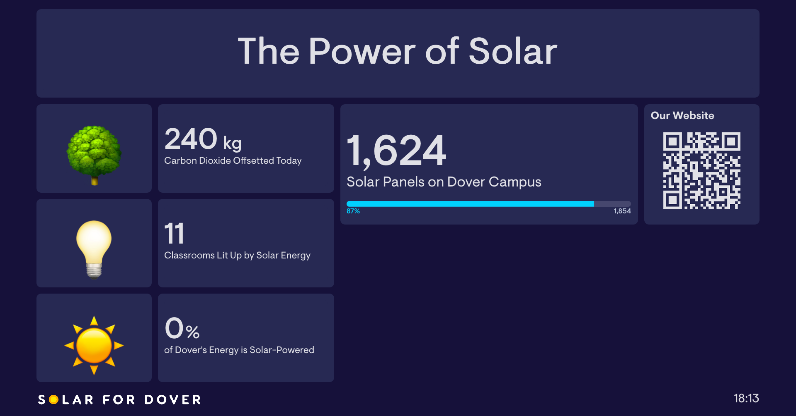

# dover-dashboard-screenshot
(DEPRECATED)
Supposed to take a daily screenshot of online dashboard and send an email. Still works at taking a screenshot, but not the most elegant. Using INTEGROMAT now.

